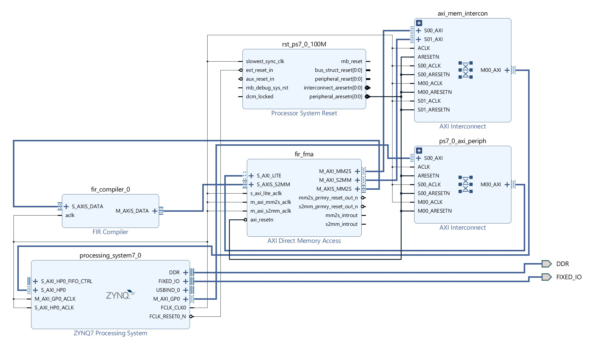

# Hardware Accelerated Bob.FM FIR Filter
An FIR filter designed to receive BOB.FM broadcast with the PYNQ-Z1 SoC FPGA board. 



## Getting Started

Determine the parasitic elements of a crystal. These are usually found in the data sheets like [this one for Abracon's ABM13W](https://abracon.com/datasheets/ABM13W.pdf). 

## Prerequisites

1. Jupyter Notebok 
2. PYNQ-Z1


## Running
In the terminal/command prompt, input the command below when in the appropriate directory.
```
jupyter notebook bob_fm_fir_filter.ipynb
```
## Authors

* **Ryan Thompson** - *Initial work* - [LinkedIn Page](https://www.linkedin.com/in/rthomp10/)
